# 基于SHA1对文件完整性进行校验

- SHA1代码部分基于[Github上的SHA1算法](https://github.com/ajalt/python-sha1)进行了部分更改，使用了Tkinter作为可视化界面方便操作。

## **使用方法**

```
python gui_main.py
```

- 调用GUI后进入可视化界面，可以单独/批量选择文件获得其哈希值。
- 可以对单个文件的完整性进行校验。
- 可以对指定文件夹下的所有文本文件计算哈希值并显示在屏幕上。
- 可以对指定文件夹下的文本文件的完整性进行监控。（待改进）

## **运行截图**

- **初始化界面**

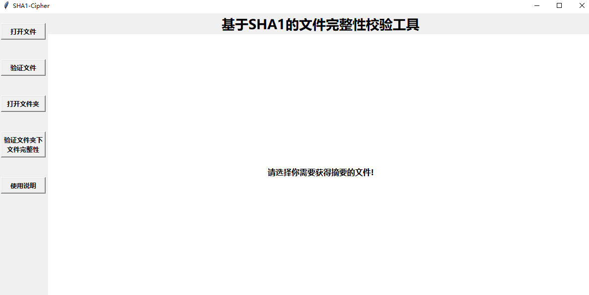

- **使用说明展示**

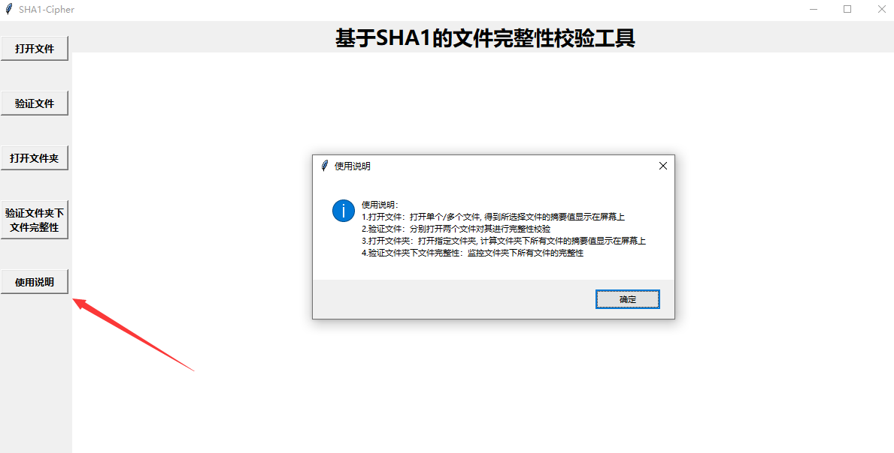

- 获得单个/批量文件的哈希值

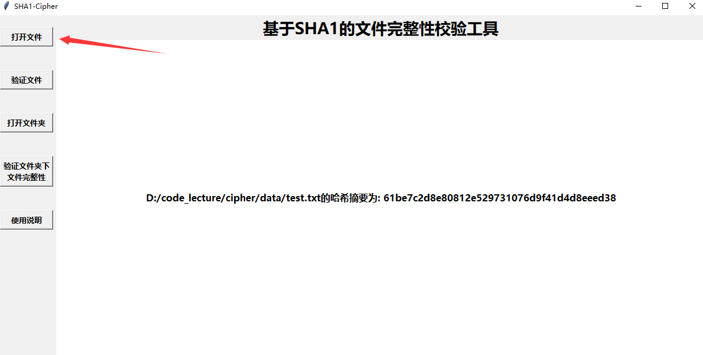

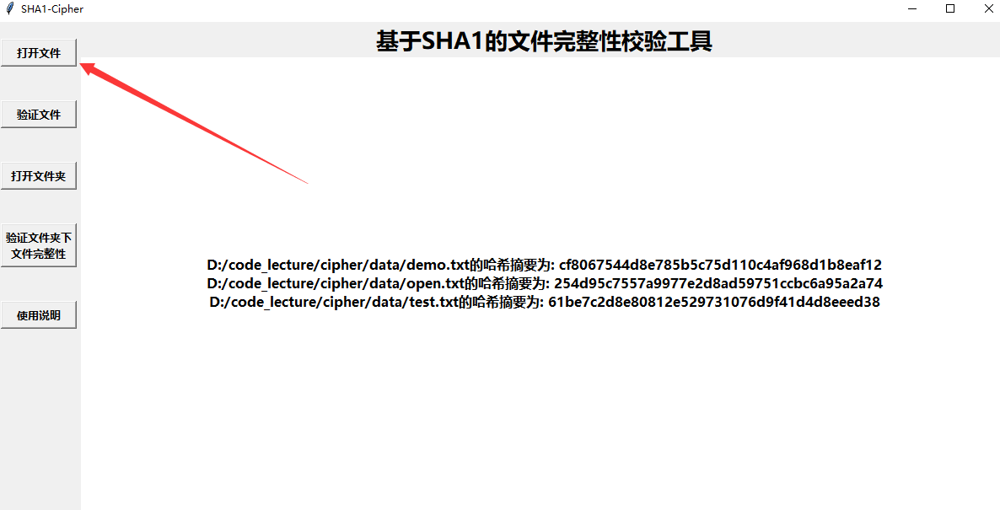

- 验证单个文件完整性

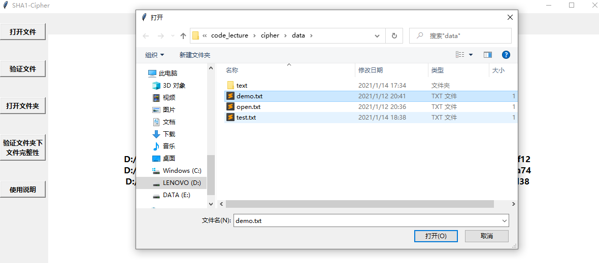

​	选择对demo.txt文本进行校验，先获得哈希值。

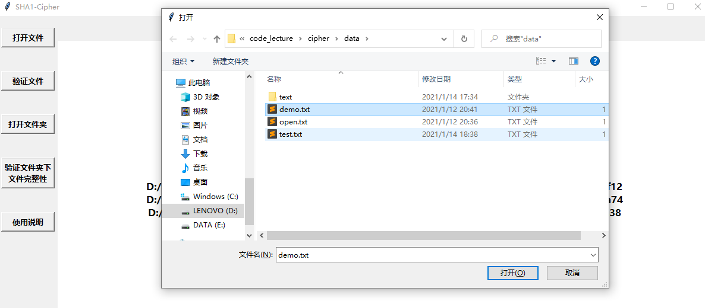

​	再次选择demo.txt(此时未对其进行更改)，结果如下

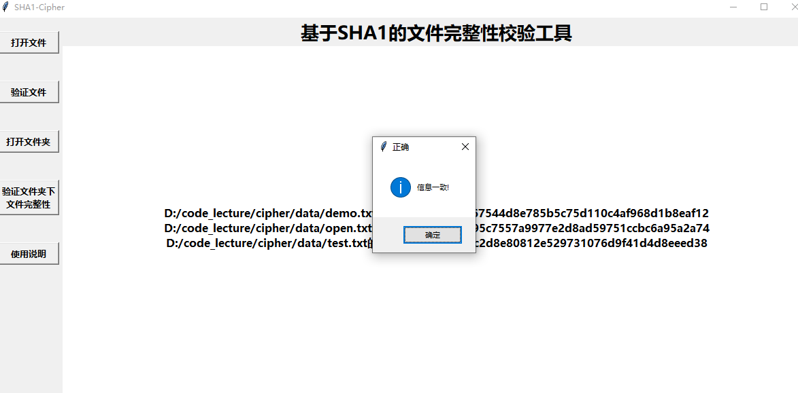

---

​	更改demo.txt的值，验证结果如下:

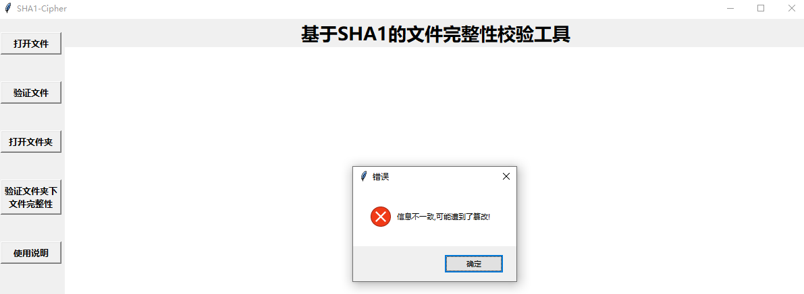

---

​	如果两次验证的文件不相同，则会出现如下警告提示：

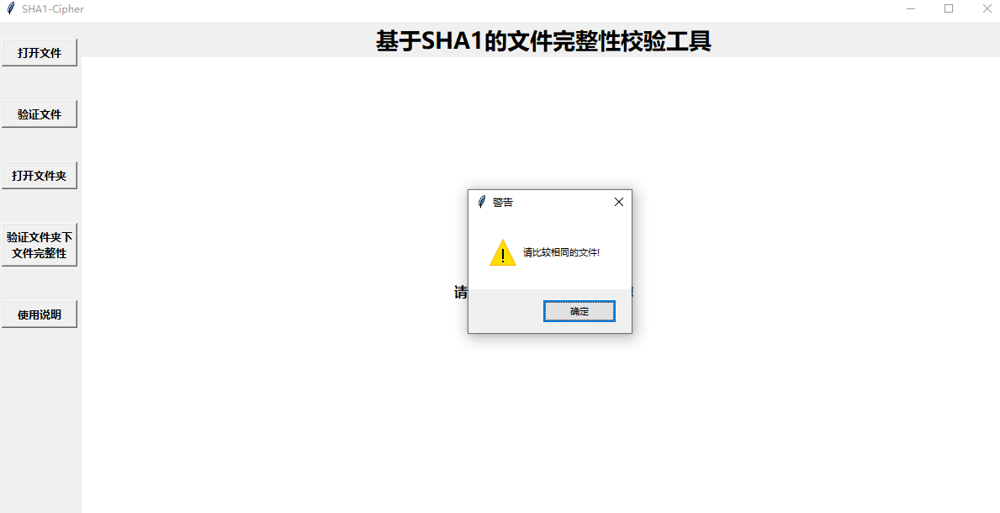

- 获得指定文件夹下所有文本文件的哈希值，显示在屏幕上

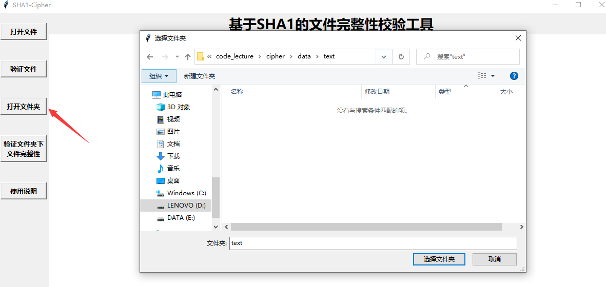

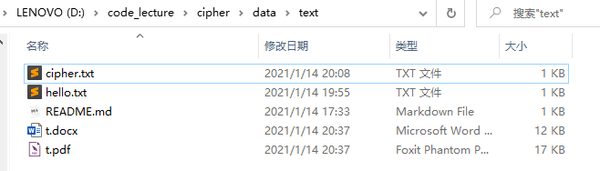

结果如下：

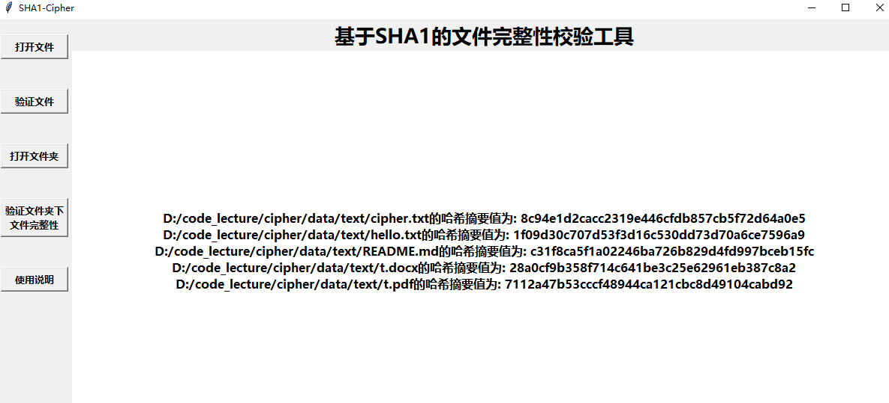

- 验证文件夹下文件的完整性：

> 使用方法同验证单个文件，略。